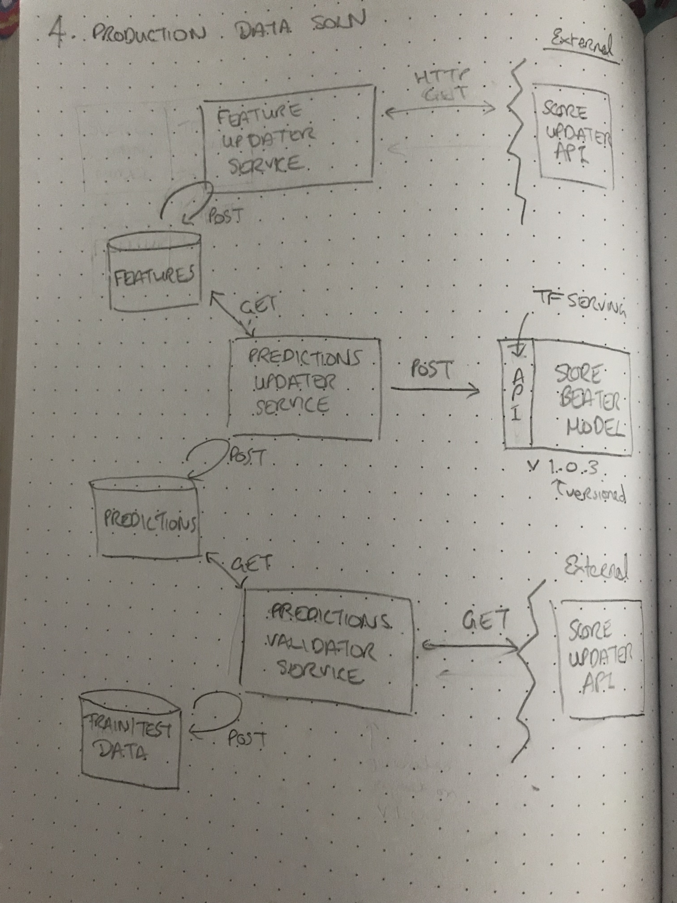

# 4. Production Data Solution

##### Answering under the assumption that the Tensorflow MLP model is most performant model and has been optimised

## Components

#### Model Serving: `score_beater`

- Reimplement `score_beater` model in Tensorflow
- Serve model via Tensorflow Serving, where model expects input features and will output probability of player beating previous free throw score
- Optionally, to avoid discrepencies in feature generation, model can input raw scores and all feature generation can live on the tensorflow model side (feasibility depends on how complicated the processing steps involved are)

#### Feature Generation: `feature_updater_service`
- After every basketball game, all players features need to be updated
- Create a `feature_updater_service` Rest service that queries external `Score API` to get updated player scores after every game
- Based on demand this can be a night cron job
- If feature generation is not handled on model side, the`feature_update_service` will implement necessary processing steps to convert updated scores into features
- Features are then written to either S3 bucket or database (size dependent)

#### Predictions: `predictions_updater_service`
- Create another REST service, `predictions_updater_service`, which will query model with updated features after the `feature_updater_service` has complete
- Again, this can be a scheduled cron job, or else triggered based on when s3 files are written 
- `predictions_updater_service` reads features from S3/Database, (either reads entire feature set or does a diff for updates) 
- Service queries the model being served via TF Serving REST API with any upated features or all features 
- All features may be desired so it's easy to do refeed of predictions 
- If querying by all features then caching should be implemented, simply delete cache if we want to predict on everything again
- Model output is parsed and predictions are written to S3/database

#### Validation: `predictions_validator_service`
- Create `predictions_validator_service ` which will query external `Score API` and keep track of whether players did actually beat their previous seasons free throw count
- This is used to acquire ground truth data 
	- Evaluate/monitor performance of current model being served 
	- Provide more train data to re-train and advance model

#### Tools
- All services communicate with external service (Scores API or TF Model) through rest so optimal language should be decided based on traffic/load.

#### Sketch

 